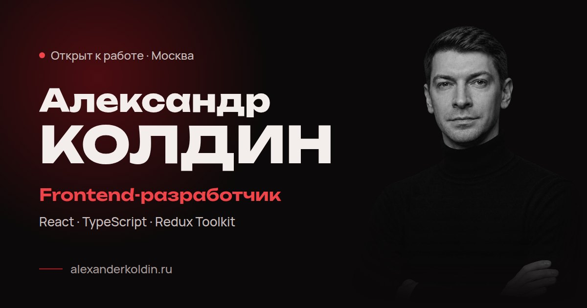

# alexanderkoldin.ru

Сайт-резюме фронтенд-разработчика. Одна страница: первый экран, «Обо мне», стек и контакты.

**Сайт:** [alexanderkoldin.ru](https://alexanderkoldin.ru)



## Стек

React 18 · TypeScript · Vite · CSS по БЭМ. Без UI-библиотек и библиотек анимации.

## Что внутри

- **Анимации без лишних ререндеров.** Свет за курсором и полоса прогресса прокрутки обновляют `style` через `ref` и `requestAnimationFrame`, без `setState`. Движение мыши и прокрутка не перерисовывают React-дерево.
- **Изолированный таймер.** Печатающаяся строка вынесена в отдельный компонент `TypedRole`, поэтому таймер перерисовывает только её.
- **Появление при прокрутке** на `IntersectionObserver` и CSS-переходах, оформлено в хук `useReveal`.
- **Доступность.** Семантическая разметка, `aria-label` у иконок, видимый фокус. При системной настройке `prefers-reduced-motion` анимации отключаются (хук `useReducedMotion`).
- **Данные отдельно от разметки.** Тексты, контакты и ссылки лежат в `src/config/site.ts`. Ссылка со значением `null` не выводится, поэтому на сайте нет нерабочих кнопок.
- **Адаптивность.** Первый экран на `100dvh`, липкая шапка, вёрстка под телефон и десктоп. Переносы заголовков настроены через `text-wrap: balance / pretty`.
- **Превью ссылки** для мессенджеров и соцсетей через Open Graph.

## Структура

```
src/
  App.tsx            сборка страницы
  config/site.ts     тексты, контакты, ссылки
  hooks/             useReveal, useReducedMotion
  components/        Header, Hero, TypedRole, Marquee, About, Stack, Contact, Spotlight, Footer
  styles/global.css  переменные: цвета, шрифты, отступы
```

У каждого компонента свой CSS-файл рядом с ним.

## Запуск

```bash
npm install
npm run dev      # http://localhost:5173
npm run build    # проверка типов и сборка в dist
```

Нужен Node.js 18 или новее. Деплой: Timeweb Cloud, автоматически при пуше в GitHub.
